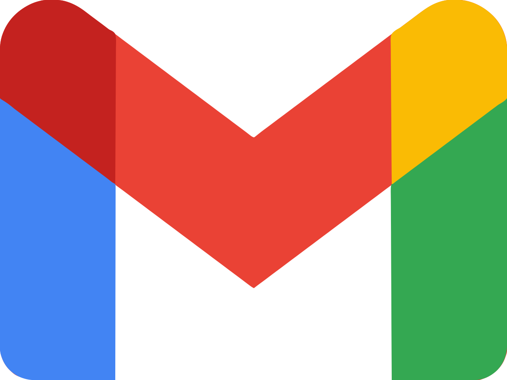
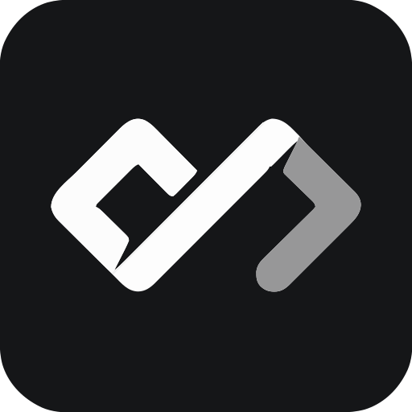
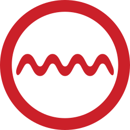

  

  

  

  

- 🏫 Pursuing **B.Tech in CSE (Core)** at Manipal Institute of Technology, Bangalore
- 🌱 Currently diving into **Android Development (Kotlin)**, **Spring Boot**, and **DSA**
- 👯 Eager to **collaborate on open-source projects** that challenge me and help me grow
- ⚙️ Passionate about building **robust backend systems** with clean architecture, scalable APIs, and secure auth
- 🧠 I learn best by **building things from scratch** – most of my projects aim to simplify and uncover the inner workings of the tech stack.

 

## 🎯 Current Focus

- Mastering core **Data Structures & Algorithms** through problem-solving
- Building and refining a portfolio of **Android apps with real-world utility**
- Contributing to **Java-based open-source projects** on GitHub
- Deepening hands-on experience with **Spring Boot microservices and security**

 

 <!-- LANGUAGES BREAKDOWN START -->

 <!-- LANGUAGES BREAKDOWN END -->

  

# 🌐 Connect With Me

## 📬 Socials & Contact

_(Ping me, follow me, or just drop a hey!)_

  
   &nbsp;&nbsp;
  
   &nbsp;&nbsp;
  
   &nbsp;&nbsp;
  
   &nbsp;&nbsp;
  

## 🏁 Coding Platforms I’m Active On

_(Where I solve problems, compete, and level up 🚀)_

  
   &nbsp;&nbsp;
  
   &nbsp;&nbsp;
  
   &nbsp;&nbsp;
  
   &nbsp;&nbsp;
  

## 🧠 Where I Learn & Hang Out

_(A mix of learning, contributing, and casual dev scrolling)_

  
   &nbsp;&nbsp;
  

 

# 🚀 Tech Stack

## 🟢 Tier 1: Primary Stack — My Core Dev Environment

### 💻 Languages & Frameworks I Use Daily

  
   &nbsp;&nbsp;
  
   &nbsp;&nbsp;
  
   &nbsp;&nbsp;
  
   &nbsp;&nbsp;
  
   &nbsp;&nbsp;
  

### 🧰 Essential Dev Tools I Can’t Live Without

  
   &nbsp;&nbsp;
  
   &nbsp;&nbsp;
  
   &nbsp;&nbsp;
  
   &nbsp;&nbsp;
  
   &nbsp;&nbsp;
  
   &nbsp;&nbsp;
  

## 🟡 Tier 2: Supporting Tech — Integrations & Styling

### 🎨 UI Libraries & Styling Tools

  
   &nbsp;&nbsp;
  
   &nbsp;&nbsp;
  
   &nbsp;&nbsp;
  
   &nbsp;&nbsp;
  
   &nbsp;&nbsp;
  
   &nbsp;&nbsp;
  

### 🧠 Backend Integrations & Messaging

  
   &nbsp;&nbsp;
  

### 🗃️ Database Systems I’ve Worked With

  
   &nbsp;&nbsp;
  
   &nbsp;&nbsp;
  
   &nbsp;&nbsp;
  

### 🌐 Deployment & Hosting

  

### 🧼 Code Quality & Analysis

  

## 🔴 Tier 3: Learning / Academic / Experimental

### 📚 Academia & Legacy Languages

  
   &nbsp;&nbsp;
  
   &nbsp;&nbsp;
  
   &nbsp;&nbsp;
  

 

# 📊 GitHub Stats

    
    
    

  

  

