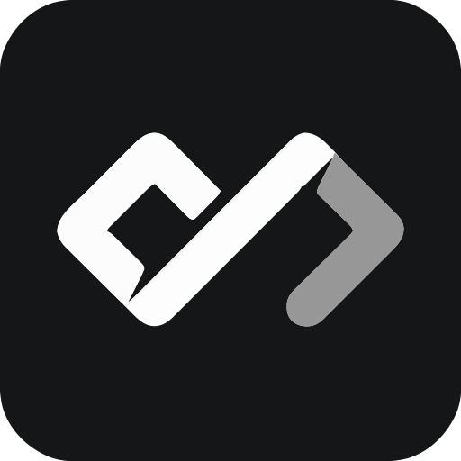
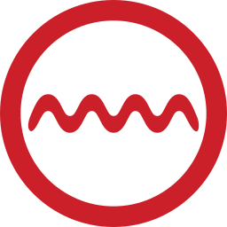

<p align="center">
  
</p>

<p align="center">
  <a href="https://github.com/sathwikhbhat">
    
  </a>
</p>

<p align="center">
  
</p>

<p align="center">
  <a href="https://github.com/sathwikhbhat">
    
  </a>
</p>

# About Me

B.Tech CSE (Core) student at Manipal Institute of Technology, Bangalore. Focused on mastering Java Backend Development with Spring Boot, building robust and scalable systems with clean architecture. I learn by creating projects from scratch and engage with open-source backend-heavy projects.

Currently deepening expertise in Data Structures & Algorithms, Spring Boot/Spring Cloud, microservices architecture, API design, secure authentication, and production-grade code quality.

<br>

 <!-- LANGUAGES BREAKDOWN START -->
```
[ LANGUAGES BREAKDOWN ]

Java                      -->     10,810 lines
JavaScript                -->      3,363 lines
JSX                       -->      3,122 lines
SQL                       -->      2,945 lines
TypeScript                -->      2,908 lines
Python                    -->      2,363 lines
Dart                      -->        643 lines
Bourne Shell              -->        599 lines
DOS Batch                 -->        585 lines
C++                       -->        455 lines
CMake                     -->        350 lines
Dockerfile                -->        149 lines
C/C++ Header              -->        106 lines
Windows Resource File     -->         69 lines
Swift                     -->         57 lines
Protocol Buffers          -->         24 lines
Kotlin                    -->          3 lines

[ TOTAL LINES OF CODE: 28,551 ]
```
 <!-- LANGUAGES BREAKDOWN END -->

<br>

# Connect

<p align="left">
  <a href="https://linkedin.com/in/sathwikhbhat" target="_blank" title="LinkedIn">
    
  </a>
  &nbsp;&nbsp;
  <a href="mailto:sathwikhbhat@gmail.com" target="_blank" title="Email">
    
  </a>
  &nbsp;&nbsp;
  <a href="https://x.com/sathwikhbhat" target="_blank" title="X">
    
  </a>
  &nbsp;&nbsp;
  <a href="https://instagram.com/sathwikhbhat" target="_blank" title="Instagram">
    
  </a>
  &nbsp;&nbsp;
  <a href="https://t.me/sathwikhbhat" target="_blank" title="Telegram">
    
  </a>
</p>

## Coding Profiles

<p align="left">
  <a href="https://leetcode.com/sathwikhbhat" target="_blank" title="LeetCode">
    
  </a>
  &nbsp;&nbsp;
  <a href="https://codeforces.com/profile/sathwikhbhat" target="_blank" title="Codeforces">
    
  </a>
  &nbsp;&nbsp;
  <a href="https://geeksforgeeks.org/user/sathwikhbhat/profile" target="_blank" title="GeeksForGeeks">
    
  </a>
  &nbsp;&nbsp;
  <a href="https://takeuforward.org/profile/sathwikhbhat" target="_blank" title="TakeUForward+">
    
  </a>
  &nbsp;&nbsp;
  <a href="https://codolio.com/profile/sathwikhbhat" target="_blank" title="Codolio">
    
  </a>
  &nbsp;&nbsp;
  <a href="https://stackoverflow.com/users/29104645/sathwikhbhat" target="_blank" title="Stack Overflow">
    
  </a>
  &nbsp;&nbsp;
  <a href="https://app.daily.dev/sathwikhbhat" target="_blank" title="daily.dev">
    
  </a>
</p>

<br>

# Tech Stack

## Core Stack

<p align="left">
  
  &nbsp;&nbsp;
  
  &nbsp;&nbsp;
  
  &nbsp;&nbsp;
  
</p>

## Databases

<p align="left">
  
  &nbsp;&nbsp;
  
  &nbsp;&nbsp;
  
  &nbsp;&nbsp;
  
</p>

## Tools & Infrastructure

<p align="left">
  
  &nbsp;&nbsp;
  
  &nbsp;&nbsp;
  
  &nbsp;&nbsp;
  
  &nbsp;&nbsp;
  
  &nbsp;&nbsp;
  
</p>

## Frontend & Web

<p align="left">
  
  &nbsp;&nbsp;
  
  &nbsp;&nbsp;
  
  &nbsp;&nbsp;
  
  &nbsp;&nbsp;
  
  &nbsp;&nbsp;
  
  &nbsp;&nbsp;
  
  &nbsp;&nbsp;
  
  &nbsp;&nbsp;
  
  &nbsp;&nbsp;
  
</p>

## Other Languages & Notebooks

<p align="left">
  
  &nbsp;&nbsp;
  
  &nbsp;&nbsp;
  
  &nbsp;&nbsp;
  
</p>

<br>

# GitHub Stats

<p align="center">
    
    
    
</p>

<p align="center">
  
</p>

<p align="center">
  <a href="https://linkedin.com/in/sathwikhbhat">
    
  </a>
</p>
