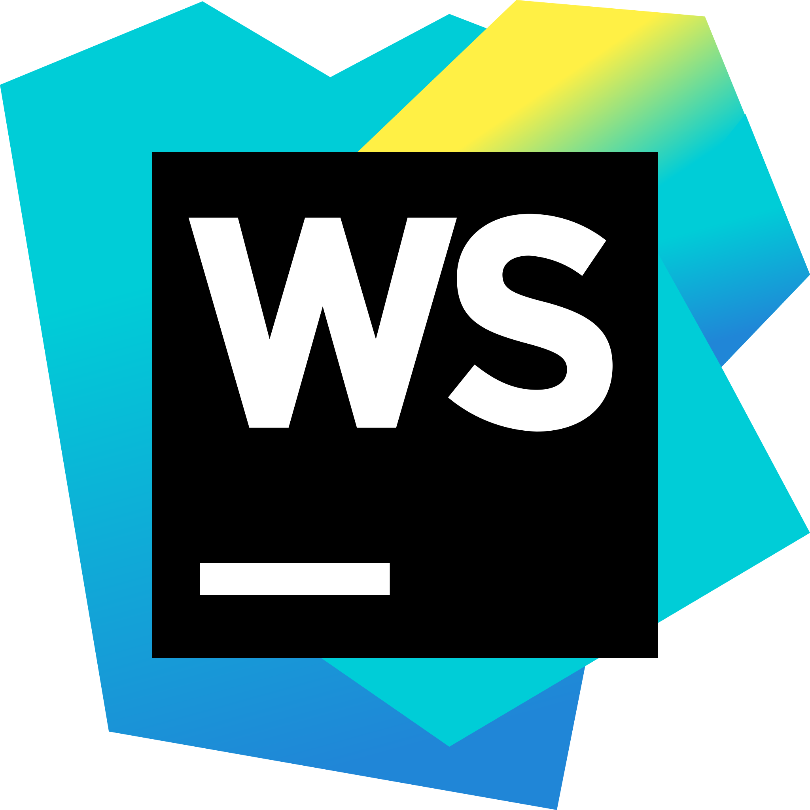

  

  

  

- 🏫 I'm pursuing **B.Tech in CSE (Core) at Manipal Institute of Technology, Bangalore**
- 🌱 I’m currently learning **Android Development**, **Spring Boot** and **Data Structures and Algorithms**
- 👯 I look forward to **collaborating on open-source projects that offer learning opportunities**
- ⚙️ Passionate about crafting **Robust Backend Systems** with clean architecture, scalable APIs, and secure authentication.
- 🧠 Big on **learning-by-doing** – most of my projects are built from scratch to understand the internals of the tech I use.
  
 

## 🎯 Current Focus
- Deepening my knowledge of **Data Structures & Algorithms**
- Building a portfolio of **Android applications**
- Contributing to open-source **Java Projects** on GitHub
- Exploring **Spring Boot** for Backend Development

 

# 🌐 Connect With Me

---

### 📬 Socials & Contact
_(Ping me, follow me, or just drop a hey!)_

  
  
  
  
  

---

### 🏁 Coding Platforms I’m Active On
_(Where I solve problems, compete, and level up 🚀)_

  
  
  
  
  

---

### 🧠 Where I Learn & Hang Out
_(A mix of learning, contributing, and casual dev scrolling)_

  
  

 

# 🚀 Tech Stack

### 🟢 Tier 1: Primary Stack — My Core Dev Environment

#### 💻 Languages & Frameworks I Use Daily

  
  
  
  
  
  

#### 🧰 Essential Dev Tools I Can’t Live Without

  
  
  
  
  
  
  

---

### 🟡 Tier 2: Supporting Tech — Integrations & Styling

#### 🎨 UI Libraries & Styling Tools

  
  
  
  
  
  
  

#### 🧠 Backend Integrations & Messaging

  
  

#### 🗃️ Database Systems I’ve Worked With

  
  
  
  

#### 🌐 Deployment & Hosting

  

#### 🧼 Code Quality & Analysis

  

---

### 🔴 Tier 3: Learning / Academic / Experimental

#### 📚 Academia & Legacy Languages

  
  
  
  

---

## 🫂 Open Source Contributions

| Project Name                        | Pull Request                                      | Description                                           | Language | Status    | Date             |
|:-----------------------------------:|:-------------------------------------------------:|:-----------------------------------------------------:|:--------:|:---------:|:----------------:|
| [Comixed](https://github.com/comixed/comixed) | [PR #2360](https://github.com/comixed/comixed/pull/2360) | Upgrade Runtime Dependency to JDK 21 on all Platforms | Java     | Completed | 07th March 2025 |

*More exciting open-source Contributions Coming Soon*

 

## 📊 GitHub Stats:

  <!-- Row 1: Stats, Languages, Streak -->
  <table>
    <tr>
      <td></td>
      <td></td>
      <td></td>
    </tr>
  </table>
   
  <!-- Row 2: Contribution Graph -->
  

    
  

  

